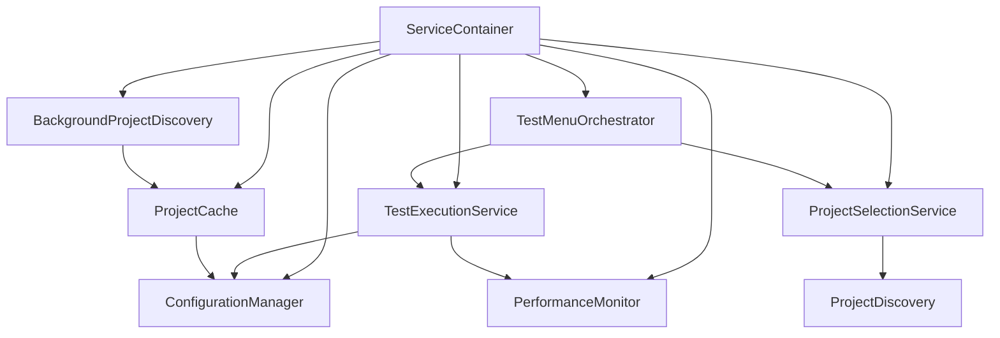

# AI Context Utilities - Architecture Documentation

## 🏗️ **Overview**

AI Context Utilities follows a **service-oriented architecture** with **dependency injection**, providing a clean, maintainable, and testable codebase. The architecture emphasizes separation of concerns, loose coupling, and high cohesion.

---

## 🎯 **Design Principles**

### **1. Service-Oriented Architecture (SOA)**
- Each major functionality is encapsulated in a dedicated service
- Services have well-defined interfaces and responsibilities
- Loose coupling between services enables independent development and testing

### **2. Dependency Injection (DI)**
- All dependencies are injected through constructors
- Services depend on interfaces, not concrete implementations
- Central `ServiceContainer` manages all service lifecycles

### **3. Single Responsibility Principle**
- Each service has one primary responsibility
- Clear separation between business logic, infrastructure, and presentation
- Focused, maintainable codebase

### **4. Testability First**
- All services can be tested in isolation
- Comprehensive mocking support for unit tests
- Integration tests validate service interactions

---

## 📦 **Service Container Architecture**

### **Core Components**

```typescript
ServiceContainer
├── 🏛️ Core Services (Infrastructure)
│   ├── ConfigurationManager     // Framework detection & configuration
│   ├── PerformanceMonitor      // Operation tracking & analytics
│   └── ProjectCache            // Intelligent caching system
│
├── 🎯 Business Logic Services
│   ├── TestMenuOrchestrator    // Main UI coordination & workflow
│   ├── TestExecutionService    // Test running with progress tracking
│   └── ProjectSelectionService // Project discovery & selection
│
├── 🔧 Infrastructure Services
│   ├── BackgroundProjectDiscovery // Continuous project scanning
│   ├── SmartFrameworkDetector     // Framework auto-detection
│   └── CommandRegistry            // VSCode command delegation (thin layer)
│
└── 🛠️ Platform Services
    ├── MacOSCompatibility     // Platform-specific adaptations
    ├── ShellScriptBridge      // External command execution
    └── ErrorHandler           // Centralized error management
```

---

## 🔄 **Service Lifecycle & Dependencies**

### **Initialization Flow**

1. **Extension Activation** (`extension.ts`)
   - Creates `ServiceContainer` with workspace configuration
   - Performs health checks on all services
   - Registers commands through `CommandRegistry`

2. **ServiceContainer Creation**
   - Initializes core services first (OutputChannel, StatusBar)
   - Creates infrastructure services with dependencies
   - Initializes business logic services
   - Starts background processes (project discovery)

3. **Command Registration**
   - `CommandRegistry` registers all VSCode commands
   - Commands delegate to `TestMenuOrchestrator`
   - Thin command layer with centralized error handling

### **Dependency Graph**



---

## 🎨 **User Interface Flow**

### **Main Interaction Pattern**

1. **Command Invocation**
   ```
   User → VSCode Command → CommandRegistry → TestMenuOrchestrator
   ```

2. **Menu Display**
   ```
   TestMenuOrchestrator → ProjectSelectionService → User Menu
   ```

3. **Test Execution**
   ```
   User Selection → TestExecutionService → PerformanceMonitor → Results
   ```

### **Key UI Components**

- **Unified Test Menu**: Single entry point with smart project suggestions
- **Performance Dashboard**: Real-time metrics and optimization recommendations
- **Project Browser**: Organized view of applications, libraries, and other projects
- **Status Bar Integration**: Live performance data in tooltip

---

## 🔧 **Core Services Deep Dive**

### **ServiceContainer** (`src/core/ServiceContainer.ts`)
**Purpose**: Central dependency injection container and service lifecycle manager

**Responsibilities**:
- Service instantiation in proper dependency order
- Health checking and validation
- Status bar management with performance integration
- Graceful service disposal

**Key Methods**:
- `create()`: Factory method with health checks
- `updateStatusBar()`: Status updates with performance tooltips
- `performHealthCheck()`: Validates all service initialization

### **ConfigurationManager** (`src/core/ConfigurationManager.ts`)
**Purpose**: Framework detection and test command optimization

**Responsibilities**:
- Auto-detection of development frameworks (Angular, React, Vue, etc.)
- Smart test command generation based on detected framework
- Configuration file management (`.aiDebugContext.yml`)
- Framework-specific optimizations

**Key Methods**:
- `getDetectedFrameworks()`: Returns detected frameworks with confidence scores
- `getSmartTestCommand()`: Generates optimized test commands
- `createExampleConfig()`: Creates framework-specific configuration

### **PerformanceMonitor** (`src/utils/PerformanceMonitor.ts`)
**Purpose**: Operation tracking and performance analytics

**Responsibilities**:
- Tracking test execution times and success rates
- Memory usage monitoring
- Performance report generation
- Optimization recommendations

**Key Methods**:
- `trackCommand()`: Wraps operations with performance tracking
- `recordMetric()`: Records individual performance metrics
- `generateReport()`: Creates comprehensive performance reports

---

## 🎯 **Business Logic Services**

### **TestMenuOrchestrator** (`src/services/TestMenuOrchestrator.ts`)
**Purpose**: Main UI coordination and workflow management

**Responsibilities**:
- Coordinating between user interface and execution services
- Managing test execution workflows
- Error handling and user feedback
- Performance dashboard presentation

**Key Methods**:
- `showMainMenu()`: Displays unified test menu
- `executeProjectTest()`: Coordinates project test execution
- `showPerformanceDashboard()`: Displays performance metrics

### **TestExecutionService** (`src/services/TestExecutionService.ts`)
**Purpose**: Test execution with real-time progress tracking

**Responsibilities**:
- Test command execution with streaming output
- Real-time progress reporting
- Performance tracking integration
- Result parsing and formatting

**Key Methods**:
- `executeTest()`: Main test execution with progress callbacks
- `getTestCommand()`: Retrieves appropriate test command
- `displayResults()`: Formats and presents test results

### **ProjectSelectionService** (`src/services/ProjectSelectionService.ts`)
**Purpose**: Project discovery and selection interface

**Responsibilities**:
- Project discovery and caching
- Recent project management
- Project selection UI presentation
- Project metadata management

**Key Methods**:
- `showMainSelectionMenu()`: Displays project selection interface
- `getAvailableProjects()`: Retrieves all discovered projects
- `getRecentProjects()`: Manages recent project history

---

## 🏗️ **Infrastructure Services**

### **BackgroundProjectDiscovery** (`src/utils/BackgroundProjectDiscovery.ts`)
**Purpose**: Continuous non-blocking project scanning

**Responsibilities**:
- Background project discovery without UI blocking
- Queue management for discovery tasks
- Integration with project caching
- Priority-based task scheduling

**Key Methods**:
- `queueDiscovery()`: Adds discovery tasks to background queue
- `getQueueStatus()`: Reports current background processing status
- `startBackgroundProcessing()`: Initiates background discovery loop

### **SmartFrameworkDetector** (`src/utils/SmartFrameworkDetector.ts`)
**Purpose**: Automatic framework detection and analysis

**Responsibilities**:
- File-based framework detection
- Confidence scoring for detected frameworks
- Framework-specific configuration recommendations
- Support for 10+ popular frameworks

**Key Methods**:
- `detectFrameworks()`: Analyzes workspace for frameworks
- `getFrameworkConfidence()`: Calculates detection confidence
- `getOptimizedCommands()`: Returns framework-specific optimizations

### **ProjectCache** (`src/utils/ProjectCache.ts`)
**Purpose**: Intelligent project structure caching

**Responsibilities**:
- Workspace structure hashing for change detection
- Project metadata caching with TTL
- Cache invalidation on structure changes
- Performance optimization for large workspaces

**Key Methods**:
- `getCachedProjects()`: Retrieves cached project data
- `cacheProjects()`: Stores project data with metadata
- `isValidCache()`: Validates cache against current structure

---

## 🧪 **Testing Architecture**

### **Test Organization**

```
src/__tests__/
├── unit/                    # Isolated unit tests
│   ├── core/               # Core service tests
│   │   ├── ServiceContainer.test.ts
│   │   └── ConfigurationManager.test.ts
│   └── utils/              # Utility service tests
│       ├── PerformanceMonitor.test.ts
│       └── ProjectCache.test.ts
├── integration/            # Service interaction tests
│   ├── ServiceIntegration.test.ts
│   └── CoreWorkflows.test.ts
└── __mocks__/             # Shared test mocks
    └── vscode.ts          # VSCode API mocks
```

### **Testing Strategy**

1. **Unit Tests**: Test individual services in isolation
   - Mock all dependencies
   - Focus on business logic and edge cases
   - High coverage of critical paths

2. **Integration Tests**: Validate service interactions
   - Test real service collaborations
   - Verify dependency injection works correctly
   - Ensure error handling flows work end-to-end

3. **Smoke Tests**: Basic functionality validation
   - Extension activation and initialization
   - Core command registration
   - Health check validation

### **Mock Strategy**

- **VSCode API**: Comprehensive mocks for all VSCode interfaces
- **File System**: Controlled mocks for file operations
- **Child Process**: Mocked command execution for test isolation
- **Service Dependencies**: Interface-based mocking for service testing

---

## 🚀 **Performance Optimizations**

### **Caching Strategy**

1. **Project Cache**
   - Workspace structure hashing for intelligent invalidation
   - Configurable TTL (default: 30 minutes)
   - Memory-efficient storage of project metadata

2. **Background Processing**
   - Non-blocking project discovery
   - Queue-based task management
   - Prioritized scanning (current workspace first)

3. **Framework Detection Cache**
   - One-time framework detection per workspace
   - Cached results with confidence scores
   - Incremental updates on configuration changes

### **Memory Management**

- **Metric Retention**: Limited to 1000 recent operations
- **Memory Monitoring**: Automatic memory usage tracking
- **Cleanup**: Proper disposal of background processes
- **Weak References**: Avoid memory leaks in service references

### **Execution Optimization**

- **Lazy Loading**: Services initialized only when needed
- **Parallel Processing**: Multiple discovery tasks run concurrently
- **Streaming**: Real-time output processing without buffering
- **Smart Commands**: Framework-optimized test execution

---

## 🔄 **Extension Lifecycle**

### **Activation Sequence**

1. **Extension Activated** (`extension.ts:activate`)
   - Workspace validation
   - ServiceContainer creation
   - Health check execution
   - Command registration

2. **Service Initialization** (`ServiceContainer.initializeServices`)
   - Core services (OutputChannel, StatusBar)
   - Platform services (MacOSCompatibility)
   - Configuration services (ConfigurationManager, ProjectCache)
   - Background services (BackgroundProjectDiscovery)
   - Business logic services (TestMenuOrchestrator, etc.)

3. **Background Startup**
   - Initial workspace discovery queued
   - Performance monitoring started
   - Framework detection initiated

### **Deactivation Sequence**

1. **Extension Deactivated** (`extension.ts:deactivate`)
   - Command registry disposal
   - Service container cleanup

2. **Service Disposal** (`ServiceContainer.dispose`)
   - Background process termination
   - Cache persistence
   - Resource cleanup

---

## 🔧 **Error Handling Strategy**

### **Error Hierarchy**

1. **User Errors**: Friendly messages with actionable suggestions
2. **System Errors**: Detailed logging with fallback behavior
3. **Configuration Errors**: Guided resolution with examples
4. **Performance Errors**: Automatic recovery with monitoring

### **Error Flow**

```
Service Error → ErrorHandler → User-Friendly Message → Status Bar Update
                            ↓
                       Detailed Logging → OutputChannel
```

### **Recovery Mechanisms**

- **Graceful Degradation**: Continue with reduced functionality
- **Automatic Retry**: Retry failed operations with backoff
- **Fallback Modes**: Alternative execution paths
- **User Guidance**: Clear instructions for manual resolution

---

## 📈 **Monitoring & Analytics**

### **Performance Metrics**

- **Operation Tracking**: All test executions with timing and success rate
- **Memory Usage**: Continuous monitoring with snapshots
- **Cache Performance**: Hit/miss ratios and efficiency metrics
- **User Patterns**: Frequently used projects and commands

### **Health Monitoring**

- **Service Health**: Individual service status tracking
- **Dependency Health**: Validation of service dependencies
- **Resource Health**: Memory and CPU usage monitoring
- **Error Rate Tracking**: Success/failure rate analysis

### **Optimization Recommendations**

- **Cache Tuning**: Suggestions for cache timeout optimization
- **Command Optimization**: Framework-specific improvements
- **Workspace Optimization**: Project structure recommendations
- **Performance Tuning**: Based on usage patterns and metrics

---

## 🔮 **Extensibility & Future Development**

### **Adding New Services**

1. **Create Service Class**
   - Implement focused responsibility
   - Define clear interface
   - Add comprehensive tests

2. **Register in ServiceContainer**
   - Add to dependency initialization
   - Configure proper service order
   - Update health checks

3. **Update Documentation**
   - Architecture diagrams
   - API documentation
   - Usage examples

### **Framework Support Extension**

1. **Update SmartFrameworkDetector**
   - Add new framework detection patterns
   - Define confidence scoring
   - Add test commands

2. **Update ConfigurationManager**
   - Add framework-specific configurations
   - Update example generation
   - Add optimization rules

### **Future Architecture Considerations**

- **Plugin System**: Support for third-party extensions
- **Remote Services**: Cloud-based analytics and optimization
- **AI Integration**: Enhanced recommendation engine
- **Multi-Workspace Support**: Cross-workspace project management

---

This architecture provides a solid foundation for current functionality while enabling future growth and enhancement. The service-oriented design ensures maintainability, testability, and extensibility for long-term success.