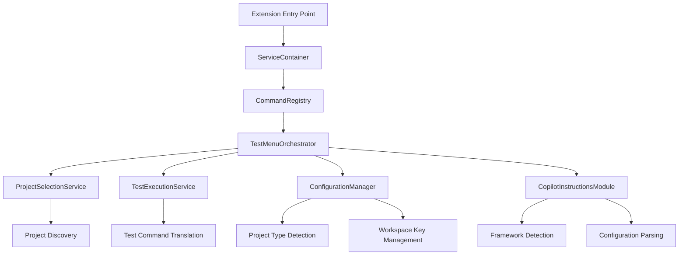
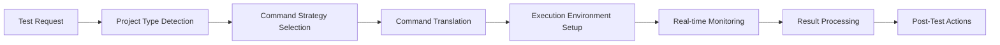

# AI Context Utilities - Technical Specifications v3.5.1

**Last Updated**: August 4, 2025  
**Author**: AI Context Util Development Team  
**Version**: 3.5.1  
**Architecture**: TypeScript VSCode Extension  
**Target Platform**: Visual Studio Code 1.74.0+

---

## Table of Contents

1. [Overview](#overview)
2. [System Architecture](#system-architecture)
3. [Core Services](#core-services)
4. [Project Type Detection](#project-type-detection)
5. [Workspace Management](#workspace-management)
6. [Command Palette Integration](#command-palette-integration)
7. [Copilot Instructions System](#copilot-instructions-system)
8. [Configuration Management](#configuration-management)
9. [Test Execution Engine](#test-execution-engine)
10. [Performance & Caching](#performance--caching)
11. [Error Handling](#error-handling)
12. [Extension Points](#extension-points)

---

## Overview

The AI Context Utilities VSCode extension is a sophisticated development workflow enhancement tool that provides universal project support, intelligent test execution, and automated Copilot instruction generation. Built with clean architecture principles and designed for scalability across different project types.

### Core Design Principles

- **Universal Project Support**: Works with Nx, Turborepo, Lerna, workspaces, and standalone projects
- **Intelligent Fallbacks**: Graceful degradation when expected tools are unavailable
- **Workspace Isolation**: Project history and configuration isolated per workspace
- **Service-Oriented Architecture**: Clear separation of concerns with dependency injection
- **Progressive Enhancement**: Core functionality works without advanced features

### Key Capabilities

- **Project Architecture Detection**: Automatically identifies and adapts to project structure
- **Workspace-Specific State**: Recent projects and test history isolated per workspace
- **Configuration Translation**: Converts ESLint/Prettier configs to natural language instructions
- **Universal Test Running**: Supports multiple test execution strategies based on project type
- **AI Context Generation**: Creates optimized context for GitHub Copilot and other AI tools

---

## System Architecture

### High-Level Architecture



### Service Dependencies

```typescript
interface ServiceContainer {
  workspaceRoot: string;
  outputChannel: vscode.OutputChannel;
  statusBar: vscode.StatusBarItem;
  configManager: ConfigurationManager;
  projectDiscovery: ProjectDiscoveryService;
  workspaceAnalyzer: WorkspaceAnalyzer;
  testActions: TestActionService;
  performanceTracker: PerformanceTracker;
  realTimeTestMonitor: RealTimeTestMonitor;
}
```

### Core Design Patterns

1. **Dependency Injection**: All services managed through `ServiceContainer`
2. **Strategy Pattern**: Different test execution strategies per project type
3. **Observer Pattern**: Real-time test monitoring and progress updates
4. **Template Method**: Consistent workflow patterns across different project types
5. **Factory Pattern**: Dynamic creation of project-specific handlers

---

## Core Services

### ServiceContainer
**Location**: `src/core/ServiceContainer.ts`  
**Purpose**: Central dependency injection container and service lifecycle management

**Key Responsibilities**:
- Service instantiation and lifecycle management
- Shared resource management (output channel, status bar)
- Performance tracking and monitoring
- Cross-service communication facilitation

**Service Registration**:
```typescript
class ServiceContainer {
  constructor(
    public workspaceRoot: string,
    public outputChannel: vscode.OutputChannel,
    public statusBar: vscode.StatusBarItem
  ) {
    this.configManager = new ConfigurationManager(workspaceRoot);
    this.projectDiscovery = new ProjectDiscoveryService(this);
    this.workspaceAnalyzer = new WorkspaceAnalyzer(workspaceRoot);
    // ... additional services
  }
}
```

### ConfigurationManager
**Location**: `src/core/ConfigurationManager.ts`  
**Purpose**: Project type detection, configuration management, and test command resolution

**Key Features**:
- **Project Type Detection**: Identifies Nx, Turborepo, Lerna, workspaces, standalone projects
- **Command Translation**: Maps abstract commands to project-specific implementations
- **Fallback Logic**: Graceful handling when expected tools are unavailable
- **Configuration Validation**: Ensures project setup matches detected type

**Project Type Detection Matrix**:
```typescript
interface ProjectTypeDetection {
  nx: () => boolean;           // nx.json + @nx/* deps
  turborepo: () => boolean;    // turbo.json + turbo dep
  lerna: () => boolean;        // lerna.json + lerna dep
  workspace: () => boolean;    // workspace: in package.json
  standalone: () => boolean;   // single package.json
}
```

### TestExecutionService
**Location**: `src/services/TestExecutionService.ts`  
**Purpose**: Universal test execution with real-time monitoring and result processing

**Test Command Resolution**:
```typescript
interface TestCommandStrategy {
  affected: string;    // Project-specific affected test command
  default: string;     // Standard test execution
  watch: string;       // Watch mode command
  coverage: string;    // Coverage collection
  debug: string;       // Debug mode execution
}
```

---

## Project Type Detection

### Detection Strategies

#### 1. Nx Workspace Detection
```typescript
isNxAvailable(): boolean {
  // Check for nx.json configuration file
  if (fs.existsSync(path.join(this.workspaceRoot, 'nx.json'))) return true;
  
  // Check for nx binary in node_modules
  const nxPath = path.join(this.workspaceRoot, 'node_modules', '.bin', 'nx');
  if (fs.existsSync(nxPath)) return true;
  
  // Check package.json for nx dependencies
  const deps = this.getPackageDependencies();
  return !!(deps['@nx/workspace'] || deps['@nrwl/workspace'] || deps['nx']);
}
```

#### 2. Package.json Script Detection
```typescript
getPackageJsonTestScripts(): TestScripts {
  const packageJson = this.readPackageJson();
  const scripts = packageJson.scripts || {};
  
  return {
    default: scripts.test ? 'npm run test' : 'npm test',
    watch: scripts['test:watch'] ? 'npm run test:watch' : undefined,
    coverage: scripts['test:coverage'] ? 'npm run test:coverage' : undefined
  };
}
```

### Command Translation Matrix

| Abstract Command | Nx | Turborepo | Lerna | Workspace | Standalone |
|-----------------|----|-----------| ------|-----------|------------|
| `affected:test` | `nx affected:test` | `turbo test --filter=[SINCE]` | `lerna run test --since` | `npm test` | `npm test` |
| `test:project` | `nx test {project}` | `turbo test --filter={project}` | `lerna run test --scope={project}` | `npm test` | `npm test` |
| `test:watch` | `nx test {project} --watch` | `turbo test --filter={project} --watch` | `lerna run test:watch --scope={project}` | `npm run test:watch` | `npm run test:watch` |

---

## Workspace Management

### Workspace-Specific State

**Problem Solved**: Previous versions stored recent projects globally, causing confusion when switching between workspaces.

**Solution**: Workspace-keyed storage with unique identifiers per workspace.

#### Workspace Key Generation
```typescript
private getWorkspaceKey(): string {
  const workspacePath = this.services.workspaceRoot;
  const pathParts = workspacePath.split(/[/\\]/);
  const workspaceName = pathParts[pathParts.length - 1] || 'unknown';
  const pathHash = this.simpleHash(workspacePath);
  
  return `${workspaceName}-${pathHash}`;
}
```

#### Storage Structure
```typescript
interface WorkspaceStorage {
  recentProjectsByWorkspace: {
    [workspaceKey: string]: RecentProject[];
  };
  // Legacy support
  recentProjects: RecentProject[];
}
```

#### Recent Project Management
```typescript
interface RecentProject {
  name: string;
  lastUsed: string;
  testCount: number;
  lastUsedTimestamp: number;
}
```

### Migration Strategy

1. **Automatic Detection**: Extension detects when workspace changes
2. **Seamless Transition**: Recent projects automatically switch to workspace-specific view
3. **Legacy Preservation**: Old global recent projects preserved during migration
4. **No Data Loss**: Users can still access historical project data

---

## Command Palette Integration

### Primary Entry Points

#### 1. 🧪 Open Testing Menu
**Command**: `aiDebugContext.runAffectedTests`  
**Keybinding**: `Ctrl/Cmd+Shift+T`  
**Implementation**: `TestMenuOrchestrator.showMainMenu()`

**Workflow**:
1. Project type detection and validation
2. Recent project loading (workspace-specific)
3. Dynamic menu construction based on project capabilities
4. User selection handling with appropriate command routing

#### 2. 🤖 Copilot Instructions
**Command**: `aiDebugContext.addCopilotInstructionContexts`  
**Implementation**: Dynamic import → `CopilotInstructionsModule.addCopilotInstructionContexts()`

**Features**:
- ESLint configuration parsing and rule translation
- Prettier configuration integration
- Framework-specific instruction generation
- User override system with priority management
- YAML frontmatter generation with metadata

#### 3. 🍎 Setup Wizard
**Command**: `aiDebugContext.runSetup`  
**Implementation**: `TestMenuOrchestrator.runSetup()` → `SetupWizard.runSetupWizard()`

**Setup Process**:
1. Environment detection and validation
2. Tool availability checking
3. Project analysis and type detection
4. Configuration template generation
5. Optimal settings recommendation

#### 4. 📊 Workspace Information
**Command**: `aiDebugContext.showWorkspaceInfo`  
**Implementation**: `TestMenuOrchestrator.showWorkspaceInfo()`

**Information Provided**:
- Project count and categorization
- Detected frameworks and versions
- Configuration status and recommendations
- Performance metrics and cache statistics

---

## Copilot Instructions System

### Architecture Overview

The Copilot Instructions system automatically generates GitHub Copilot-compatible instruction files from project configuration, providing AI assistants with context-aware guidance for code generation and assistance.

### File Generation Structure

```
.github/instructions/
├── copilot-instructions.md           # Main entry point (Priority: 200)
├── user-overrides.instructions.md    # User customizations (Priority: 1000)
└── frameworks/                       # Framework-specific files
    ├── eslint-rules.instructions.md      # ESLint rules translated (Priority: 30)
    ├── prettier-formatting.instructions.md # Prettier settings (Priority: 20)
    ├── angular-context.instructions.md    # Angular official docs (Priority: 900)
    ├── angular.instructions.md            # Angular patterns (Priority: 100)
    └── typescript.instructions.md         # TypeScript guidelines (Priority: 50)
```

### Priority System

| Priority | File Type | Description | Override Behavior |
|----------|-----------|-------------|-------------------|
| 1000 | User Overrides | Team decisions and customizations | Always takes precedence |
| 900 | Official Framework Docs | Angular.dev context files | High authority |
| 200 | Project Main Instructions | Workspace-specific guidelines | Standard priority |
| 100 | Framework Guidelines | React, Angular, Vue patterns | Framework-specific |
| 50 | Language Guidelines | TypeScript, JavaScript rules | Language-specific |
| 30 | Code Quality Rules | ESLint rules translated | Quality enforcement |
| 20 | Formatting Rules | Prettier configuration | Style consistency |

### ESLint Configuration Parser

**Location**: `src/modules/copilotInstructions/parsing/ESLintConfigParser.ts`

**Capabilities**:
- **Multi-Format Support**: Handles ESLint flat config (9.0+) and legacy formats
- **Rule Translation**: Converts technical ESLint rules to natural language
- **TypeScript Integration**: Specialized handling for @typescript-eslint rules
- **Monorepo Support**: Detects workspace-specific configurations
- **Rule Categorization**: Groups rules by purpose (Type Safety, Imports, etc.)

**Rule Translation Example**:
```typescript
// ESLint Rule: "@typescript-eslint/no-unused-vars": "error"
// Generated Instruction: "Remove unused variables and imports to keep code clean"

// ESLint Rule: "prefer-const": "error" 
// Generated Instruction: "Use const for variables that are never reassigned"
```

### Prettier Configuration Integration

**Location**: `src/modules/copilotInstructions/parsing/PrettierConfigParser.ts`

**Features**:
- **Configuration Discovery**: Finds Prettier configs in various formats
- **Option Translation**: Converts formatting options to readable guidelines
- **File-Specific Overrides**: Handles different rules for different file types
- **Validation**: Ensures configuration is valid and provides helpful errors

### Framework Detection Service

**Location**: `src/modules/copilotInstructions/FrameworkDetectionService.ts`

**Detection Capabilities**:
```typescript
interface FrameworkDetection {
  angular: {
    version: string;
    features: ['signals', 'standalone', 'control-flow'];
    confidence: number;
  };
  react: {
    version: string;
    features: ['hooks', 'concurrent', 'server-components'];
    confidence: number;
  };
  vue: {
    version: string;
    features: ['composition-api', 'script-setup'];
    confidence: number;
  };
}
```

---

## Configuration Management

### Configuration File Structure

**Location**: `.aiDebugContext.yml` (workspace root)

**Format**:
```yaml
# Project architecture type
framework: nx | turborepo | lerna | workspace | standalone

# Test commands for different scenarios
testCommands:
  default: npm test
  affected: nx affected:test
  watch: npm run test:watch
  coverage: npm run test:coverage
  debug: npm run test:debug

# File patterns for test discovery
patterns:
  test: ["**/*.spec.ts", "**/*.test.ts"]
  source: ["src/**/*.ts"]
  ignore: ["node_modules/**", "dist/**"]

# Performance optimizations
performance:
  parallel: true
  maxWorkers: 4
  cache: true
  cacheTimeout: 30

# Output preferences
output:
  verbose: true
  format: legacy | minimal | detailed
  preserveAnsi: false
  showTiming: true
```

### Framework-Specific Presets

The system includes optimized presets for different project types:

#### Nx Workspace (Default)
```yaml
framework: nx
testCommands:
  default: npx nx test {project}
  affected: npx nx affected:test
  watch: npx nx test {project} --watch
```

#### Turborepo
```yaml
framework: turborepo  
testCommands:
  default: turbo test --filter={project}
  affected: turbo test --filter=[SINCE]
  watch: turbo test --filter={project} --watch
```

#### Standalone Project
```yaml
framework: standalone
testCommands:
  default: npm test
  affected: npm test  # No affected concept
  watch: npm run test:watch
```

### Auto-Configuration

1. **Project Type Detection**: Automatically identifies project architecture
2. **Template Selection**: Chooses optimal configuration template
3. **Customization Prompts**: Guides users through project-specific settings
4. **Validation**: Ensures configuration matches detected project structure

---

## Test Execution Engine

### Universal Test Execution

The test execution engine provides a consistent interface for running tests across different project types, with intelligent fallbacks and real-time monitoring.

### Command Resolution Pipeline



### Test Command Strategies

#### Strategy Interface
```typescript
interface TestStrategy {
  canHandle(projectType: string): boolean;
  resolveCommand(mode: TestMode, project?: string): string;
  getAffectedCommand(baseBranch?: string): string;
  supportsWatch(): boolean;
  supportsCoverage(): boolean;
}
```

#### Nx Strategy
```typescript
class NxTestStrategy implements TestStrategy {
  resolveCommand(mode: TestMode, project?: string): string {
    switch(mode) {
      case 'affected': return 'npx nx affected:test';
      case 'default': return `npx nx test ${project || ''}`;
      case 'watch': return `npx nx test ${project} --watch`;
      case 'coverage': return `npx nx test ${project} --coverage`;
    }
  }
}
```

#### Package.json Fallback Strategy
```typescript
class PackageJsonStrategy implements TestStrategy {
  resolveCommand(mode: TestMode, project?: string): string {
    const scripts = this.getPackageScripts();
    switch(mode) {
      case 'affected': return scripts.test; // No affected concept
      case 'default': return scripts.test;
      case 'watch': return scripts.testWatch || scripts.test;
      case 'coverage': return scripts.testCoverage || scripts.test;
    }
  }
}
```

### Real-Time Test Monitoring

**Location**: `src/services/TestExecutionService.ts`

**Features**:
- **Live Output Processing**: Streams test output in real-time
- **Progress Tracking**: Shows individual test file completion
- **Error Detection**: Identifies and highlights compilation errors
- **Performance Monitoring**: Tracks test execution timing
- **Result Caching**: Caches successful test results for performance

**Output Processing Pipeline**:
```typescript
interface TestOutputProcessor {
  processLine(line: string): void;
  detectTestFile(line: string): string | null;
  detectTestResult(line: string): TestResult | null;
  detectError(line: string): TestError | null;
  updateProgress(progress: TestProgress): void;
}
```

---

## Performance & Caching

### Test Result Caching

**Location**: `src/utils/TestResultCache.ts`

**Caching Strategy**:
- **File-Based Invalidation**: Cache invalidated when test or source files change
- **Project-Specific**: Separate cache per project for better hit rates
- **Configuration Sensitivity**: Cache considers test configuration changes
- **Time-Based Expiration**: Automatic cleanup of stale cache entries

**Cache Key Generation**:
```typescript
interface CacheKey {
  projectName: string;
  affectedFiles: string[];
  testConfig: {
    command: string;
    mode: string;
    verbose: boolean;
  };
  configHash: string;
}
```

### Performance Tracking

**Location**: `src/core/ServiceContainer.ts`

**Metrics Collected**:
- Command execution time
- Project discovery duration
- Configuration parsing time
- Test result processing time
- Cache hit/miss ratios

**Performance Monitoring**:
```typescript
interface PerformanceMetrics {
  commandExecution: {
    [commandName: string]: {
      totalTime: number;
      executionCount: number;
      averageTime: number;
    };
  };
  cacheStats: {
    hits: number;
    misses: number;
    hitRate: number;
  };
}
```

---

## Error Handling

### Error Classification

The extension uses a hierarchical error handling system that classifies errors and provides appropriate user feedback.

#### Error Types

1. **User Errors**: Issues the user can fix
   - Missing configuration files
   - Invalid project structure
   - Missing dependencies

2. **System Errors**: Internal extension issues
   - Service initialization failures
   - Unexpected API responses
   - File system access problems

3. **Environment Errors**: External tool issues
   - Missing Node.js/npm
   - Git not available
   - Project tool not installed

#### Error Response Strategy

```typescript
class ErrorHandler {
  handleError(error: Error, context: string): void {
    if (this.isUserError(error)) {
      MessageUtils.showWarning(`Please check your configuration: ${error.message}`);
    } else if (this.isEnvironmentError(error)) {
      MessageUtils.showError(`Environment issue: ${error.message}`, 'Setup Guide');
    } else {
      MessageUtils.showError(`Internal error: ${error.message}`, 'Report Issue');
    }
  }
}
```

### Graceful Degradation

The extension is designed to provide value even when certain features are unavailable:

1. **Missing Nx**: Falls back to package.json scripts
2. **No ESLint Config**: Generates basic code quality guidelines
3. **No Prettier Config**: Provides general formatting recommendations
4. **Limited Permissions**: Operates in read-only mode where possible

---

## Extension Points

### Plugin Architecture

The extension is designed with extensibility in mind, allowing for future enhancements and third-party integrations.

#### Service Registration

```typescript
interface ServiceRegistry {
  registerTestStrategy(name: string, strategy: TestStrategy): void;
  registerFrameworkDetector(name: string, detector: FrameworkDetector): void;
  registerConfigParser(format: string, parser: ConfigParser): void;
  registerInstructionGenerator(type: string, generator: InstructionGenerator): void;
}
```

#### Custom Test Strategies

Third parties can register custom test execution strategies:

```typescript
// Example: Bazel test strategy
class BazelTestStrategy implements TestStrategy {
  canHandle(projectType: string): boolean {
    return projectType === 'bazel';
  }
  
  resolveCommand(mode: TestMode, project?: string): string {
    return `bazel test ${project ? `//${project}:*` : '//...'}`;
  }
}

// Registration
serviceRegistry.registerTestStrategy('bazel', new BazelTestStrategy());
```

#### Custom Framework Detectors

```typescript
// Example: Svelte framework detector
class SvelteDetector implements FrameworkDetector {
  detect(workspaceRoot: string): FrameworkInfo | null {
    // Detection logic for Svelte projects
    return {
      name: 'Svelte',
      version: this.detectSvelteVersion(),
      confidence: 0.9,
      features: ['sveltekit', 'stores', 'components']
    };
  }
}
```

### Configuration Extensions

The configuration system supports custom fields for specialized project setups:

```yaml
# Standard configuration
framework: custom
testCommands:
  default: my-custom-test-runner

# Custom extensions
extensions:
  customTool:
    enabled: true
    config: 
      specialOption: value
```

---

## Migration & Compatibility

### Version Migration

The extension handles migrations between versions automatically:

#### v3.5.0 → v3.5.1 Migration

1. **Recent Projects**: Migrates from global to workspace-specific storage
2. **Configuration**: Preserves existing settings while adding new capabilities
3. **Generated Files**: Updates Copilot instruction files with new features

#### Backward Compatibility

- **Legacy Configuration**: Old `.aiDebugContext.yml` files continue to work
- **API Stability**: Public interfaces maintain backward compatibility
- **Graceful Upgrades**: New features are opt-in when possible

### Future Compatibility

The architecture is designed to support planned v3.6.0 features:

- **Universal Project Detection**: Framework for non-Nx project types
- **Adaptive Menu System**: Context-aware command menus
- **Enhanced Context Generation**: Tool-specific Copilot instructions
- **Configuration Templates**: Project-type-specific setup wizards

---

## Technical Debt & Known Limitations

### Current Limitations

1. **Test Pattern Detection**: Limited to common patterns, may miss custom setups
2. **Monorepo Complexity**: Advanced monorepo setups may require manual configuration
3. **Windows Path Handling**: Some path operations may need Windows-specific adjustments
4. **Large Workspace Performance**: Very large workspaces may experience slower project discovery

### Planned Improvements

1. **Enhanced Project Discovery**: More sophisticated project structure detection
2. **Configuration Validation**: Real-time validation of configuration changes
3. **Performance Optimization**: Lazy loading and caching improvements
4. **Extended Framework Support**: Additional framework detectors and strategies

### Technical Debt

1. **Service Dependencies**: Some circular dependencies between services need refactoring
2. **Error Handling**: Inconsistent error handling patterns across modules
3. **Test Coverage**: Some edge cases in project detection need additional test coverage
4. **Documentation**: Some internal APIs need better documentation

---

## Conclusion

The AI Context Utilities extension provides a robust, extensible platform for development workflow enhancement with universal project support. The architecture balances flexibility with simplicity, allowing the extension to work across diverse project types while maintaining a consistent user experience.

The service-oriented design and intelligent fallback mechanisms ensure that users get value regardless of their project setup, while the extensible architecture allows for future enhancements and customizations.

---

*This document is maintained as a living specification and is updated with each major release.*