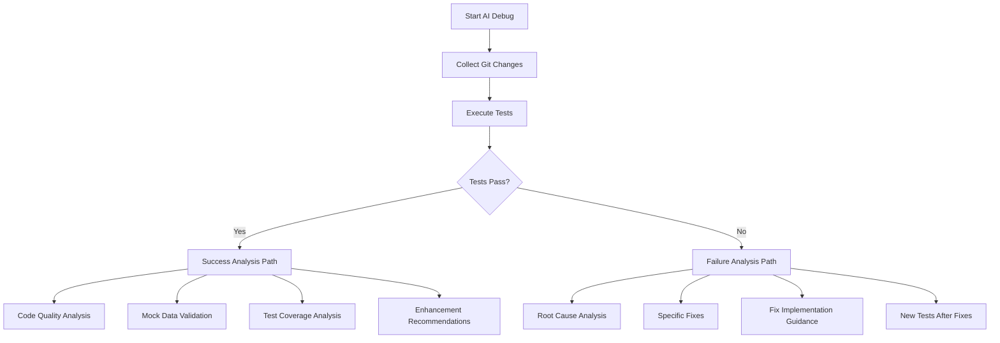

# Feature Specification: AI TEST DEBUG Module (Main Workflow)

**Module Name**: AI TEST DEBUG Module  
**Component**: `AIDebugComponent`  
**Backend Services**: `CopilotIntegration.ts`, `WorkflowOrchestrator.ts`  
**Status**: ✅ COMPLETE  
**Version**: 2.0.0

## 🎯 Purpose

The AI TEST DEBUG Module serves as the orchestration center for the entire debugging workflow, combining git changes and test results with intelligent AI analysis through GitHub Copilot integration. It provides different analysis paths based on test outcomes and generates comprehensive debugging context.

## 🚀 Core Workflow Logic

### Workflow Decision Tree
The module implements sophisticated logic to determine the appropriate analysis path:



### Analysis Paths

#### Test Failure Analysis Path
**Priority**: Fix existing failures first, then suggest improvements
1. **Root Cause Analysis**
   - Identify specific changes breaking tests
   - Detect type mismatches and interface changes
   - Analyze method signature modifications

2. **Concrete Fixes (Priority 1)**
   - Provide exact code changes with line numbers
   - Update test expectations for business logic changes
   - Fix type definitions and interface updates

3. **Implementation Guidance (Priority 1)**
   - Order of fixes (dependencies first)
   - Potential side effects to monitor
   - Getting tests green as immediate priority

4. **New Test Suggestions (Priority 2)**
   - Only after existing tests are fixed
   - Missing coverage for new functionality
   - Edge cases and regression prevention

#### Test Success Analysis Path  
**Priority**: Quality assurance and continuous improvement
1. **Code Quality Analysis**
   - Review code changes for improvements
   - Identify code smells and anti-patterns
   - Performance optimization opportunities

2. **Mock Data Validation (CRITICAL)**
   - **Most Important**: Review all mock data for realism
   - Verify mock objects match real-world structures
   - Check mocked API responses match actual contracts
   - Validate edge cases and realistic variations
   - Identify false positives from unrealistic mocks

3. **Test Coverage Analysis**
   - Missing test coverage for new functionality
   - Edge cases requiring additional testing
   - File-specific coverage analysis
   - Regression prevention scenarios

4. **Enhancement Recommendations**
   - Better error handling and validation
   - Documentation and typing improvements
   - Defensive programming suggestions

## 🏗️ Technical Implementation

### Frontend Component (`AIDebugComponent`)
```typescript
@Component({
  selector: 'app-ai-debug',
  standalone: true,
  imports: [CommonModule, FormsModule],
  changeDetection: ChangeDetectionStrategy.OnPush
})
export class AIDebugComponent {
  // Workflow state management
  workflowState = signal<WorkflowState>({ phase: 'idle' });
  analysisResults = signal<AIAnalysisResults | null>(null);
  isExecuting = signal<boolean>(false);
  
  // Progress tracking
  currentStep = signal<string>('');
  stepProgress = signal<number>(0);
  totalSteps = signal<number>(5);
  
  // Results management
  debugContext = signal<string>('');
  copilotResponse = signal<string>('');
  
  // Main workflow execution
  async executeAIDebugWorkflow() {
    try {
      // Step 1: Collect file selection context
      this.updateProgress('Collecting file changes...', 1);
      const fileContext = await this.collectFileContext();
      
      // Step 2: Execute tests  
      this.updateProgress('Running tests...', 2);
      const testResults = await this.executeTests();
      
      // Step 3: Determine analysis path
      this.updateProgress('Analyzing results...', 3);
      const analysisPath = this.determineAnalysisPath(testResults);
      
      // Step 4: Generate AI analysis
      this.updateProgress('Generating AI analysis...', 4);
      const analysis = await this.generateAIAnalysis(fileContext, testResults, analysisPath);
      
      // Step 5: Process and present results
      this.updateProgress('Processing results...', 5);
      await this.processResults(analysis);
      
    } catch (error) {
      this.handleWorkflowError(error);
    }
  }
  
  private determineAnalysisPath(results: TestResult[]): AnalysisPath {
    return results.some(r => r.status === 'failed') ? 'failure' : 'success';
  }
}
```

### Backend Services

#### CopilotIntegration Service
```typescript
export class CopilotIntegration {
  // Core AI analysis methods
  async analyzeTestFailures(context: DebugContext): Promise<FailureAnalysis>;
  async validateMockData(context: DebugContext): Promise<MockAnalysis>;
  async suggestNewTests(context: DebugContext): Promise<TestSuggestions>;
  async analyzeCodeQuality(context: DebugContext): Promise<QualityAnalysis>;
  
  // GitHub Copilot Chat integration
  private async sendCopilotRequest(prompt: PromptTemplate, context: any): Promise<string>;
  private createFailureAnalysisPrompt(context: DebugContext): PromptTemplate;
  private createSuccessAnalysisPrompt(context: DebugContext): PromptTemplate;
  private createMockValidationPrompt(context: DebugContext): PromptTemplate;
}
```

#### WorkflowOrchestrator Service
```typescript
export class WorkflowOrchestrator {
  async executeCompleteWorkflow(config: WorkflowConfig): Promise<WorkflowResult>;
  
  // Workflow phases
  private async collectFileSelection(mode: FileSelectionMode): Promise<FileContext>;
  private async executeTests(config: TestConfig): Promise<TestResults>;
  private async performAIAnalysis(context: AnalysisContext): Promise<AIAnalysis>;
  private async generateDebugContext(results: WorkflowResults): Promise<string>;
}
```

## 🤖 AI Integration Features

### GitHub Copilot Integration
The module leverages VSCode's Language Model Chat API for seamless Copilot integration:

#### Prompt Engineering
**Failure Analysis Prompt Template**:
```
You are an expert test debugging assistant. Analyze test failures and provide actionable solutions.

Response Format:
1. Root Cause Analysis - Identify why tests are failing
2. Specific Fixes - Provide exact code changes with line numbers  
3. Implementation Guidance - Order of fixes and dependencies
4. Prevention Strategies - Suggest improvements

## Context:
Git Diff: [diff content]
Test Results: [test failures with stack traces]
Project Info: [NX project metadata]

Please analyze these failures and provide concrete solutions.
```

**Success Analysis Prompt Template**:
```
You are an expert code quality and testing assistant. Review passing tests for potential issues and improvements.

Response Format:
1. Mock Data Validation - CRITICAL: Check all mocks for realism
2. Code Quality Analysis - Improvements and optimizations
3. Test Coverage Analysis - Missing scenarios and edge cases
4. Enhancement Recommendations - Future-proofing suggestions

## Context:
Git Diff: [code changes]
Test Results: [passing tests with performance data]
Mock Usage: [extracted mock patterns]

Focus heavily on mock data validation to prevent false positives.
```

#### Advanced AI Features
- **Context-Aware Analysis**: Tailors prompts based on project type and change patterns
- **Streaming Responses**: Real-time AI response streaming for better UX
- **Multi-turn Conversations**: Follow-up questions and clarifications
- **Response Processing**: Structured parsing of AI responses for actionable items

### Copilot Diagnostics Integration  
```typescript
// Real-time Copilot integration status
export class CopilotDiagnostics {
  async checkCopilotAvailability(): Promise<CopilotStatus>;
  async validateLanguageModels(): Promise<ModelAvailability>;
  async testCopilotConnection(): Promise<ConnectionStatus>;
  
  // User feedback for Copilot issues
  displayCopilotStatus(status: CopilotStatus): void;
  provideTroubleshootingGuidance(issue: CopilotIssue): void;
}
```

## 🎨 User Interface

### Workflow Progress Display
- **Step-by-step Progress**: Visual progress bar with current step description
- **Real-time Updates**: Live status updates during each phase
- **Cancellation Support**: Ability to cancel long-running operations
- **Error Recovery**: Clear error messages with recovery options

### Analysis Results Interface
**Tabbed Results View**:
1. **Overview Tab**: High-level summary and recommendations
2. **Analysis Tab**: Detailed AI analysis and suggestions
3. **Context Tab**: Complete debug context for manual review
4. **Export Tab**: Export options and integration features

### Interactive Features
- **Expandable Sections**: Collapsible analysis sections for better organization
- **Copy to Clipboard**: Easy copying of analysis results and context
- **File Operations**: Save debug context and analysis to files
- **Integration Links**: Direct links to relevant code files and lines

## 🧪 Testing Coverage

### Component Tests
```typescript
describe('AIDebugComponent', () => {
  describe('Workflow Orchestration', () => {
    it('should execute complete workflow for test failures');
    it('should execute complete workflow for test success');
    it('should handle workflow cancellation properly');
    it('should recover from workflow errors gracefully');
  });

  describe('Analysis Path Selection', () => {
    it('should select failure analysis path for failing tests');
    it('should select success analysis path for passing tests');
    it('should handle mixed test results correctly');
  });

  describe('Progress Management', () => {
    it('should update progress correctly throughout workflow');
    it('should provide accurate step descriptions');
    it('should handle progress errors and edge cases');
  });

  describe('Results Processing', () => {
    it('should process and display AI analysis results');
    it('should format results for optimal readability');
    it('should support export functionality');
  });
});
```

### Service Integration Tests  
```typescript
describe('WorkflowOrchestrator', () => {
  it('should orchestrate complete end-to-end workflow');
  it('should integrate all modules correctly');
  it('should handle service failures and recovery');
  it('should generate comprehensive debug context');
});

describe('CopilotIntegration', () => {
  it('should integrate with GitHub Copilot successfully');
  it('should handle Copilot unavailability gracefully');
  it('should process AI responses correctly');
  it('should provide fallback analysis when Copilot fails');
});
```

## 📄 Output Format

### Generated File: `ai-debug-context.txt`
The AI TEST DEBUG module generates the most comprehensive output file:

```
=================================================================
🤖 AI DEBUG CONTEXT - OPTIMIZED FOR ANALYSIS
=================================================================

PROJECT: Angular NX Monorepo
TARGET: [project/workspace name]
STATUS: ✅ TESTS PASSING / ❌ TESTS FAILING
FOCUS: [analysis focus area]
TIMESTAMP: [ISO timestamp]

=================================================================
🎯 ANALYSIS REQUEST
=================================================================

Please analyze this context and provide:

[Conditional analysis requests based on test status]

FOR TEST FAILURES:
1. 🔍 ROOT CAUSE ANALYSIS
2. 🛠️ CONCRETE FIXES (PRIORITY 1)
3. 🧪 EXISTING TEST FIXES (PRIORITY 1)  
4. 🚀 IMPLEMENTATION GUIDANCE (PRIORITY 1)
5. ✨ NEW TEST SUGGESTIONS (PRIORITY 2 - AFTER FIXES)

FOR TEST SUCCESS:
1. 🔍 CODE QUALITY ANALYSIS
2. 🎭 MOCK DATA VALIDATION (CRITICAL)
3. 🧪 TEST COVERAGE ANALYSIS
4. 🚀 ENHANCEMENT RECOMMENDATIONS
5. 🛡️ ROBUSTNESS IMPROVEMENTS

=================================================================
🧪 TEST RESULTS ANALYSIS
=================================================================
[Complete test results from TEST module]

=================================================================
📋 CODE CHANGES ANALYSIS  
=================================================================
[Complete git diff analysis from DIFF module]

=================================================================
🚀 AI ASSISTANT GUIDANCE
=================================================================
This context file is optimized for AI analysis with:
• Structured failure information for easy parsing
• Code changes correlated with test failures
• Clear focus areas for targeted analysis
• Actionable fix categories for systematic resolution

Context file size: [X] lines (optimized for AI processing)
```

## 🔗 Integration Points

### Module Dependencies
- **DIFF Module**: Receives git change context and file selections
- **TEST Module**: Receives test execution results and performance data
- **PR DESC Module**: Provides analysis context for PR description generation

### Service Orchestration
- **GitIntegration**: Git operations and change analysis
- **TestRunner**: Test execution and result processing
- **CopilotIntegration**: AI analysis and response generation
- **FileSystemService**: Debug context file operations

## 🚀 Advanced Features

### Intelligent Context Building
- **Smart Context Prioritization**: Focuses AI attention on most relevant information
- **Change Correlation Analysis**: Links specific code changes to test failures
- **Impact Assessment**: Evaluates the scope and severity of detected issues
- **Recommendation Ranking**: Prioritizes suggestions by impact and effort

### Workflow Optimization
- **Adaptive Analysis**: Adjusts analysis depth based on complexity
- **Caching Strategy**: Caches intermediate results for faster iterations
- **Parallel Processing**: Executes independent analysis tasks in parallel
- **Resource Management**: Monitors and manages system resource usage

### Error Handling and Recovery
- **Graceful Degradation**: Continues workflow even when individual components fail
- **Retry Logic**: Automatic retry for transient failures
- **Fallback Analysis**: Provides basic analysis when AI integration fails
- **User Notification**: Clear communication about errors and recovery options

## 📈 Success Metrics

### Functional Success
- **Workflow Completion**: 100% successful workflow completion for valid inputs
- **Analysis Accuracy**: AI analysis provides actionable insights in >90% of cases
- **Context Quality**: Generated debug context enables effective AI assistance
- **Integration Reliability**: Seamless integration between all modules

### User Experience Success  
- **Workflow Speed**: Complete analysis in <2 minutes for typical scenarios
- **Clear Guidance**: Users understand next steps from analysis results
- **Error Recovery**: Users can easily recover from failures and continue workflow

## 🎯 Critical Success Factors

### Mock Data Validation (CRITICAL)
The most important aspect of the success analysis path is **mock data validation**:
- **Realistic Mock Objects**: Ensures mocks match real-world data structures
- **API Contract Validation**: Verifies mocked responses match actual API contracts
- **Edge Case Coverage**: Identifies missing edge cases in mock data
- **False Positive Detection**: Catches tests that pass due to unrealistic mocks

This feature prevents the dangerous scenario where tests pass but don't represent real-world behavior.

## 🔮 Future Enhancements

### Advanced AI Features
- **Custom AI Models**: Support for specialized debugging models
- **Learning System**: Learn from user feedback to improve analysis
- **Predictive Analysis**: Predict potential issues before they become failures
- **Code Generation**: Generate fix code automatically based on analysis

### Workflow Extensions
- **CI/CD Integration**: Integration with continuous integration pipelines
- **Team Collaboration**: Share debug contexts and analysis results
- **Historical Analysis**: Track debugging patterns and success rates over time

---

**Status**: ✅ COMPLETE - Ready for integration testing  
**Next Steps**: Integration testing with GitHub Copilot and end-to-end workflow validation
