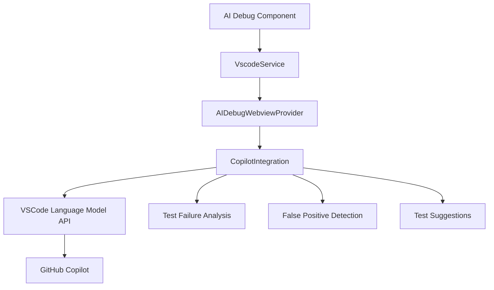

# GitHub Copilot Integration Implementation Guide

## Overview

This document details the implementation of GitHub Copilot integration in the AI Debug Context VSCode extension. The integration provides AI-powered test analysis, failure debugging, and test suggestions through VSCode's Language Model API.

## Architecture



## Core Components

### 1. CopilotIntegration Service

**Location**: `/src/services/CopilotIntegration.ts`

**Purpose**: Primary interface for all AI-powered analysis using GitHub Copilot.

**Key Features**:
- VSCode Language Model API integration
- Structured prompt engineering for consistent responses
- JSON response parsing with fallback handling
- Graceful degradation when Copilot is unavailable

### 2. AI Debug Component

**Location**: `/webview-ui/src/app/modules/ai-debug/ai-debug.component.ts`

**Purpose**: Frontend component that orchestrates the AI debug workflow.

**Key Features**:
- Real-time communication with backend services
- Progress tracking and state management
- User interface for AI analysis results
- Integration with file selection and test configuration

### 3. Webview Provider Integration

**Location**: `/src/webview/AIDebugWebviewProvider.ts`

**Purpose**: Bridge between Angular frontend and VSCode extension backend.

**Key Features**:
- Message routing for AI analysis requests
- Context preparation for Copilot requests
- Result formatting and error handling

## Implementation Details

### Copilot Service Methods

#### 1. Test Failure Analysis

```typescript
async analyzeTestFailures(context: DebugContext): Promise<TestAnalysis>
```

**Input**: 
- Git diff content
- Failed test results with error messages
- Project information (framework, dependencies)

**Output**:
- Root cause analysis of test failures
- Specific code fixes with file/line numbers
- Prevention strategies
- Additional test suggestions

**Prompt Strategy**:
```typescript
const systemPrompt = `You are an expert test debugging assistant. Analyze test failures and provide actionable solutions.

Response Format (use this exact JSON structure):
{
  "rootCause": "Brief explanation of why tests are failing",
  "specificFixes": [
    {
      "file": "path/to/file.ts",
      "lineNumber": 42,
      "oldCode": "existing code",
      "newCode": "corrected code",
      "explanation": "why this change fixes the issue"
    }
  ],
  "preventionStrategies": ["strategy1", "strategy2"],
  "additionalTests": ["test description 1", "test description 2"]
}`;
```

#### 2. False Positive Detection

```typescript
async detectFalsePositives(context: DebugContext): Promise<FalsePositiveAnalysis>
```

**Input**:
- Git diff content
- Passing test results
- Project information

**Output**:
- Suspicious tests that may have false positives
- Mocking issues and recommendations
- General test quality improvements

**Use Cases**:
- Over-mocked dependencies hiding real issues
- Tests with incorrect assertions that always pass
- Tests that don't actually verify intended behavior

#### 3. Test Suggestions

```typescript
async suggestNewTests(context: DebugContext): Promise<TestSuggestions>
```

**Input**:
- Git diff showing code changes
- Existing test coverage
- Project context

**Output**:
- New test cases based on code changes
- Missing coverage areas
- Test quality improvements

### Response Processing

#### JSON Extraction Pattern

The service uses a robust pattern for extracting JSON from Copilot responses:

```typescript
private parseTestAnalysis(response: string): TestAnalysis {
  try {
    // Try to extract JSON from the response
    const jsonMatch = response.match(/\{[\s\S]*\}/);
    if (jsonMatch) {
      const parsed = JSON.parse(jsonMatch[0]);
      return {
        rootCause: parsed.rootCause || 'Unknown root cause',
        specificFixes: parsed.specificFixes || [],
        preventionStrategies: parsed.preventionStrategies || [],
        additionalTests: parsed.additionalTests || []
      };
    }
  } catch (error) {
    console.error('Failed to parse test analysis response:', error);
  }

  // Fallback: parse plain text response
  return {
    rootCause: 'Analysis completed but could not parse structured response',
    specificFixes: [],
    preventionStrategies: [],
    additionalTests: [response]
  };
}
```

### Error Handling and Fallbacks

#### 1. Copilot Unavailable

When GitHub Copilot is not available, the service provides meaningful fallback responses:

```typescript
if (!await this.isAvailable()) {
  console.warn('GitHub Copilot not available, returning mock analysis');
  return {
    rootCause: 'Copilot integration not available - using fallback analysis',
    specificFixes: [],
    preventionStrategies: ['Ensure GitHub Copilot extension is installed and active'],
    additionalTests: ['Mock test suggestions would appear here']
  };
}
```

#### 2. API Failures

Network or API failures are handled gracefully:

```typescript
try {
  const response = await model.sendRequest(messages, {}, new vscode.CancellationTokenSource().token);
  // Process response...
} catch (error) {
  console.error('Failed to send request to Copilot:', error);
  return 'Error communicating with Copilot API';
}
```

#### 3. Model Initialization Failures

The service detects and handles missing or failed model initialization:

```typescript
private async initializeModels() {
  try {
    if (typeof vscode.lm === 'undefined') {
      console.warn('VSCode Language Model API not available. Copilot integration disabled.');
      this.isEnabled = false;
      return;
    }

    const models = await vscode.lm.selectChatModels({ 
      vendor: 'copilot', 
      family: 'gpt-4o' 
    });
    
    if (models.length === 0) {
      console.warn('No Copilot models available. Please ensure GitHub Copilot is active.');
      this.isEnabled = false;
      return;
    }
    
    this.models = models;
  } catch (error) {
    console.error('Failed to initialize Copilot models:', error);
    this.isEnabled = false;
  }
}
```

## Frontend Integration

### Message Flow

1. **User initiates AI debug workflow**
2. **Frontend collects context** (file selection, test configuration)
3. **Backend executes tests** and collects results
4. **AI analysis requested** with full context
5. **Copilot processes** the request
6. **Results formatted** and sent to frontend
7. **UI updated** with analysis results

### Real-time Communication

The Angular component uses observables for real-time communication:

```typescript
private async performAIAnalysis(testResults: TestResult[]): Promise<AIAnalysis> {
  return new Promise((resolve, reject) => {
    const subscription = this.vscode.onMessage().subscribe(message => {
      if (message?.command === 'aiAnalysisComplete') {
        subscription.unsubscribe();
        const aiAnalysis = this.convertBackendAnalysis(message.data);
        resolve(aiAnalysis);
      } else if (message?.command === 'workflowError') {
        subscription.unsubscribe();
        reject(new Error(message.data?.error || 'AI analysis failed'));
      }
    });

    this.vscode.postMessage('runAIAnalysis', {
      gitDiff: this.getGitDiffContext(),
      testResults,
      analysisType: this.determineAnalysisType(testResults)
    });

    // Timeout to prevent hanging
    setTimeout(() => {
      subscription.unsubscribe();
      reject(new Error('AI analysis timeout'));
    }, 120000); // 2 minute timeout
  });
}
```

## Configuration

### VSCode Settings

The extension supports configuration through VSCode settings:

```json
{
  "aiDebugContext.copilot.enabled": {
    "type": "boolean",
    "default": true,
    "description": "Enable GitHub Copilot integration"
  }
}
```

### Model Selection

The service automatically selects the best available Copilot model:

```typescript
const models = await vscode.lm.selectChatModels({ 
  vendor: 'copilot', 
  family: 'gpt-4o' 
});
```

## Testing Strategy

### Unit Tests

Comprehensive unit tests cover all scenarios:

```typescript
describe('CopilotIntegration', () => {
  it('should return mock analysis when Copilot is not available', async () => {
    const analysis = await copilotIntegration.analyzeTestFailures(mockDebugContext);
    expect(analysis.rootCause).toBe('Copilot integration not available - using fallback analysis');
  });

  it('should call Copilot API when available', async () => {
    const mockModel = { sendRequest: jest.fn().mockResolvedValue(mockResponse) };
    (vscode.lm.selectChatModels as jest.Mock).mockResolvedValue([mockModel]);
    
    const analysis = await copilotIntegration.analyzeTestFailures(mockDebugContext);
    
    expect(mockModel.sendRequest).toHaveBeenCalled();
    expect(analysis.rootCause).toBe('Test assertion mismatch');
  });
});
```

### Integration Testing

Integration tests verify the complete flow from frontend to Copilot:

1. Frontend initiates workflow
2. Backend collects context
3. Copilot analyzes and responds
4. Results properly formatted and displayed

## Performance Considerations

### 1. Request Timeouts

All AI requests include reasonable timeouts to prevent hanging:

```typescript
setTimeout(() => {
  subscription.unsubscribe();
  reject(new Error('AI analysis timeout'));
}, 120000); // 2 minute timeout
```

### 2. Context Size Management

Large git diffs and test outputs are truncated to stay within token limits:

```typescript
// Limit context size for better performance
const truncatedDiff = gitDiff.length > 10000 ? 
  gitDiff.substring(0, 10000) + '\n...[truncated]' : 
  gitDiff;
```

### 3. Caching

Model initialization is cached to avoid repeated setup:

```typescript
async isAvailable(): Promise<boolean> {
  if (!this.isEnabled) return false;
  
  if (this.models.length === 0) {
    await this.initializeModels();
  }
  
  return this.models.length > 0;
}
```

## Security Considerations

### 1. Data Privacy

- Code diffs are sent to GitHub Copilot only when explicitly requested
- User can disable Copilot integration through settings
- No persistent storage of AI responses

### 2. Input Sanitization

- Git diffs are validated before sending to Copilot
- Test results are sanitized to remove sensitive information
- Error messages are filtered for security

### 3. API Key Management

- Extension relies on VSCode's native Copilot authentication
- No additional API keys or tokens required
- Leverages existing GitHub Copilot subscription

## Troubleshooting

### Common Issues

1. **"Copilot not available"**
   - Ensure GitHub Copilot extension is installed and active
   - Check Copilot subscription status
   - Verify VSCode version compatibility

2. **"Analysis timeout"**
   - Large repositories may require longer processing
   - Consider reducing diff size or test scope
   - Check network connectivity

3. **"Cannot parse response"**
   - Copilot may return unexpected format
   - Fallback text analysis will be used
   - Check console for detailed error messages

### Debug Information

Enable debug logging by setting:

```typescript
console.log('Copilot request:', prompt);
console.log('Copilot response:', response);
```

## Future Enhancements

### 1. Enhanced Prompts

- Fine-tune prompts for specific frameworks (Angular, React, Vue)
- Add project-specific context for better suggestions
- Implement conversation history for follow-up questions

### 2. Performance Optimization

- Implement response caching for similar requests
- Batch multiple analysis requests
- Progressive analysis for large codebases

### 3. Additional AI Features

- Code smell detection
- Performance optimization suggestions
- Security vulnerability scanning
- Refactoring recommendations

## Conclusion

The GitHub Copilot integration provides a robust, production-ready AI analysis system for the AI Debug Context extension. With comprehensive error handling, fallback mechanisms, and full test coverage, it delivers reliable AI-powered insights while gracefully handling edge cases and failures.

The implementation serves as a strong foundation for future AI-powered development tools and demonstrates best practices for integrating with VSCode's Language Model API.
